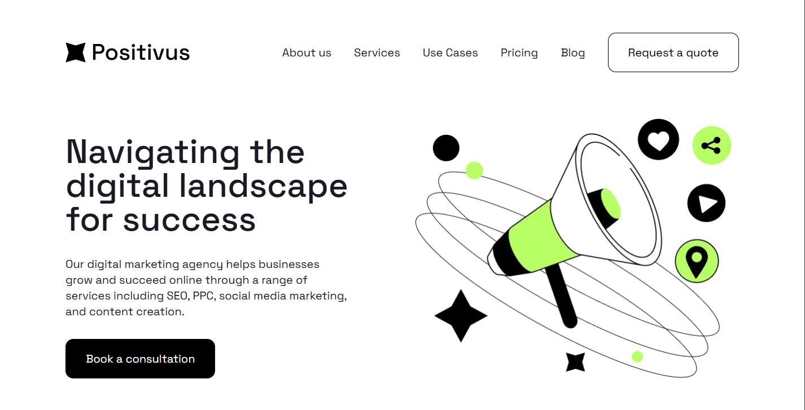

# Positivus



Agência de Marketing Digital - Site Institucional Responsivo

## 📋 Sobre o Projeto

O **Positivus** é um site institucional moderno e responsivo para uma agência de marketing digital. O projeto foi desenvolvido utilizando as melhores práticas de desenvolvimento web com Next.js, TypeScript e TailwindCSS, oferecendo uma experiência de usuário fluida e uma interface visualmente impactante.

### Funcionalidades Principais

- **Navegação Responsiva**: Barra de navegação com menu mobile adaptativo
- **Seção de Hero**: Header impactante com call-to-action
- **Logotipos de Clientes**: Carrossel infinito animado (marquee)
- **Serviços**: Grid de cards apresentando os serviços da agência (SEO, PPC, Social Media, Email Marketing, Content Creation, Analytics)
- **CTA Section**: Card de conversão "Let's Make Things Happen"
- **Design System**: Sistema de cores personalizado com tons de lime, dark, gray e white
- **Tipografia Personalizada**: Fonte Space Grotesk do Google Fonts
- **Animações**: Marquee para logos e carrossel para estudos de caso

## 🛠️ Stack Tecnológico

### Frontend Framework
- **Next.js 16.2.4**: Framework React para aplicações web com renderização no servidor
- **React 19.2.4**: Biblioteca JavaScript para construção de interfaces de usuário
- **TypeScript 5**: Superset tipado do JavaScript para maior segurança e produtividade

### Estilização
- **TailwindCSS 4**: Framework utility-first para estilização rápida e consistente
- **PostCSS**: Processador CSS para otimização e transformação

### Ícones e Fontes
- **Lucide React 1.8.0**: Biblioteca de ícones modernos e consistentes
- **Google Fonts**: Space Grotesk para tipografia principal
- **Geist & Geist Mono**: Fontes do Next.js para UI e código

### Desenvolvimento
- **ESLint 9**: Ferramenta de linting para código JavaScript/TypeScript
- **ESLint Config Next**: Configuração otimizada para Next.js

## 📁 Estrutura do Projeto

```
positivus/
├── app/                      # Diretório principal do Next.js (App Router)
│   ├── favicon.ico          # Ícone do site
│   ├── globals.css          # Estilos globais e design system
│   ├── layout.tsx           # Layout raiz da aplicação
│   └── page.tsx             # Página principal (Home)
├── components/              # Componentes reutilizáveis
│   ├── Header/             # Componentes do header
│   │   ├── Header.tsx      # Header principal
│   │   ├── Logotypes.tsx   # Carrossel de logotipos
│   │   └── Navbar.tsx      # Barra de navegação
│   ├── Services/           # Componentes de serviços
│   │   └── Card.tsx        # Card de serviço individual
│   ├── BlockTitle.tsx      # Componente de título de seção
│   ├── Button.tsx          # Componente de botão
│   ├── CaseStudiesCard.tsx # Card de estudos de caso
│   └── LetsMakeThingsHappenCard.tsx # Card de CTA
├── constants/               # Constantes e dados estáticos
│   └── CardServices.tsx    # Array de serviços
├── public/                  # Arquivos estáticos
│   └── services-images/    # Imagens dos serviços
│   └── company-logos/      # Imagens dos logotipos
├── .gitignore              # Arquivos ignorados pelo Git
├── package.json            # Dependências e scripts
├── tsconfig.json           # Configuração do TypeScript
├── next.config.ts          # Configuração do Next.js
├── postcss.config.mjs      # Configuração do PostCSS
└── eslint.config.mjs       # Configuração do ESLint
```

## 🎨 Design System

### Cores
- **Lime**: `#b9ff66` - Cor de destaque principal
- **Dark**: `#191a23` - Cor de texto e fundos escuros
- **Gray**: `#f3f3f3` - Cor de fundo secundária
- **White**: `#ffffff` - Cor de fundo principal

### Tipografia
- **Fonte Principal**: Space Grotesk (300, 400, 500, 600, 700)
- **Escalas de Tamanho**:
  - H1: 60px (desktop) / 43px (mobile)
  - H2: 40px (desktop) / 36px (mobile)
  - H3: 30px (desktop) / 24px (mobile)
  - H4: 20px (desktop) / 16px (mobile)
  - Body: 16px (desktop) / 14px (mobile)

### Componentes de Estilo
- **Label**: Badge com fundo lime para categorização
- **Typo Accent**: Texto com destaque em duas cores
- **Marquee**: Animação infinita para carrossel de logos
- **Carousel**: Animação para galeria de estudos de caso

## 🚀 Instalação e Execução

### Pré-requisitos
- Node.js 20 ou superior
- npm, yarn ou pnpm

### Passos de Instalação

1. **Clone o repositório**
```bash
git clone https://github.com/amandazzoc/Teste-Asimov-Academy.git
cd parte-1/positivus
```

2. **Instale as dependências**
```bash
npm install
# ou
yarn install
# ou
pnpm install
```

3. **Execute o servidor de desenvolvimento**
```bash
npm run dev
# ou
yarn dev
# ou
pnpm dev
```

4. **Acesse no navegador**
```
http://localhost:3000
```

## 📜 Scripts Disponíveis

- `npm run dev` - Inicia o servidor de desenvolvimento
- `npm run build` - Cria uma build de produção otimizada
- `npm start` - Inicia o servidor de produção
- `npm run lint` - Executa o ESLint para verificar o código

## 🌐 Deploy

O projeto está configurado para deploy na Vercel, plataforma nativa do Next.js.

### Deploy na Vercel

1. **Conecte seu repositório** à Vercel
2. **Configure as variáveis de ambiente** (se necessário)
3. **Deploy automático** será realizado em cada push para a branch principal

### Build de Produção
```bash
npm run build
npm start
```

## 🧩 Componentes Principais

### Header
- Navbar responsiva com menu mobile
- Hero section com mensagem principal
- Logotypes com animação marquee infinita

### Services
- Grid responsivo (1 coluna mobile, 2 colunas desktop)
- Cards com variantes de cor (light, lime, dark, limeDark)
- Ilustrações para cada serviço

### Case Studies
- Carrossel animado com estudos de caso
- Design responsivo com scroll horizontal

### CTA Section
- Card de conversão "Let's Make Things Happen"
- Design destacado com cor lime

## 📱 Responsividade

O projeto foi desenvolvido com abordagem mobile-first, garantindo experiência otimizada em:

- **Mobile**: < 768px
- **Tablet**: 768px - 1024px
- **Desktop**: > 1024px

## 🔧 Configuração

### TypeScript
Configurado com strict mode para máxima segurança de tipos. Path aliases configurados para `@/` apontando para a raiz do projeto.

### TailwindCSS
Utilizando a versão 4 com configuração inline via CSS. Cores customizadas definidas no design system.

### ESLint
Configuração Next.js com regras para React e TypeScript.

## 📄 Licença

Este projeto é privado e propriedade da Positivus Digital Marketing Agency.

## 👥 Desenvolvimento

Desenvolvido como parte do teste técnico para a Asimov Academy.

---

**Positivus** © 2024 - Transformando negócios através do marketing digital