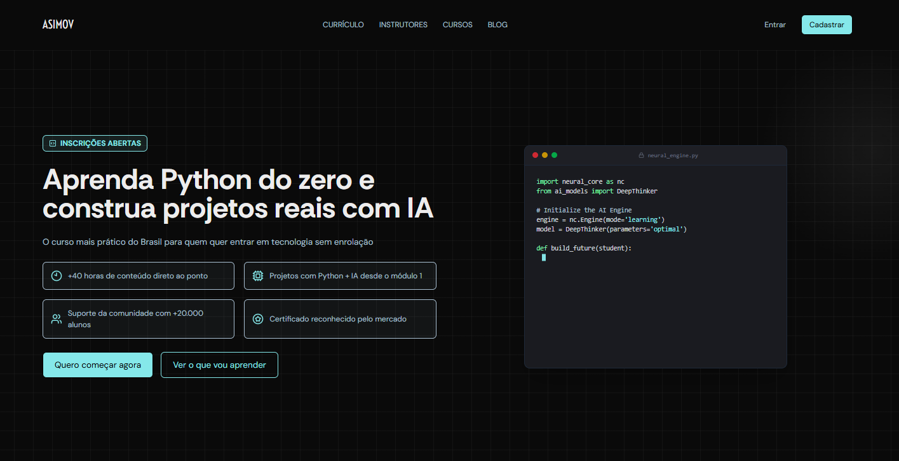

# ASIMOV



Landing Page para Curso de Python com IA

## 📋 Sobre o Projeto

O **ASIMOV** é uma landing page moderna e responsiva para um curso de Python com Inteligência Artificial. O projeto foi desenvolvido utilizando as melhores práticas de desenvolvimento web com Next.js, TypeScript e TailwindCSS, oferecendo uma experiência de usuário fluida e uma interface visualmente impactante com animações interativas.

### Funcionalidades Principais

- **Navegação Responsiva**: Barra de navegação com menu hambúrguer adaptativo para mobile
- **Header Animado**: Seção hero com efeito spotlight que segue o movimento do mouse
- **Bloco de Código Animado**: Animação de digitação com syntax highlighting e auto-reinício
- **Cards de Benefícios**: Grid responsivo apresentando os diferenciais do curso
- **Design System**: Sistema de cores personalizado com tons de cyan e azul
- **Tipografia Personalizada**: Fontes DM Sans, Rethink Sans e Voltaire do Google Fonts
- **Animações**: Efeito de digitação, spotlight, bounce e transições suaves
- **Componentes Reutilizáveis**: Button, Badge, BenefitCard, AnimatedCodeBlock

## 🛠️ Stack Tecnológico

### Frontend Framework
- **Next.js 15**: Framework React para aplicações web com App Router
- **React 19**: Biblioteca JavaScript para construção de interfaces de usuário
- **TypeScript 5**: Superset tipado do JavaScript para maior segurança e produtividade

### Estilização
- **TailwindCSS 4**: Framework utility-first para estilização rápida e consistente
- **PostCSS**: Processador CSS para otimização e transformação

### Ícones e Fontes
- **Lucide React**: Biblioteca de ícones modernos e consistentes
- **next/font/google**: DM Sans, Rethink Sans e Voltaire para tipografia

### Desenvolvimento
- **ESLint**: Ferramenta de linting para código JavaScript/TypeScript
- **ESLint Config Next**: Configuração otimizada para Next.js

## 📁 Estrutura do Projeto

```
asimov/
├── app/                      # Diretório principal do Next.js (App Router)
│   ├── favicon.ico          # Ícone do site
│   ├── globals.css          # Estilos globais e design system
│   ├── layout.tsx           # Layout raiz com fontes
│   └── page.tsx             # Página principal (Home)
├── components/              # Componentes reutilizáveis
│   ├── AnimatedCodeBlock.tsx  # Bloco de código animado
│   ├── Badge.tsx              # Badge reutilizável
│   ├── BenefitCard.tsx        # Card de benefícios
│   ├── Button.tsx             # Botão com variantes
│   ├── Header.tsx             # Header com efeito spotlight
│   └── Navbar.tsx            # Navbar responsiva
├── .gitignore              # Arquivos ignorados pelo Git
├── package.json            # Dependências e scripts
├── tsconfig.json           # Configuração do TypeScript
├── next.config.ts          # Configuração do Next.js
├── postcss.config.mjs      # Configuração do PostCSS
└── eslint.config.mjs       # Configuração do ESLint
```

## 🎨 Design System

### Cores
- **Primária**: `#85e8ea` - Cor de destaque principal (cyan)
- **Texto Secundário**: `#aac0d2` - Cor de texto secundário (azul acinzentado)
- **Background**: `#ffffff` - Cor de fundo principal
- **Foreground**: `#171717` - Cor de texto principal

### Tipografia
- **Fonte de Títulos**: Rethink Sans (400, 500, 600, 700)
- **Fonte de Corpo**: DM Sans (400, 500, 600, 700)
- **Fonte de Logo**: Voltaire (400)
- **Escalas de Tamanho**:
  - H1: 60px (desktop) / 36px (mobile)
  - Body: 18px (desktop) / 16px (mobile)

### Componentes de Estilo
- **Button**: Variantes primary, secondary e text com tamanhos md e lg
- **Badge**: Componente para informações destacadas com ícone
- **BenefitCard**: Card para exibir benefícios com ícone e texto
- **AnimatedCodeBlock**: Bloco de código com animação de digitação

## 🚀 Instalação e Execução

### Pré-requisitos
- Node.js 20 ou superior
- npm, yarn ou pnpm

### Passos de Instalação

1. **Clone o repositório**
```bash
git clone https://github.com/amandazzoc/Teste-Asimov-Academy.git
cd parte-2/asimov
```

2. **Instale as dependências**
```bash
npm install
# ou
yarn install
# ou
pnpm install
```

3. **Execute o servidor de desenvolvimento**
```bash
npm run dev
# ou
yarn dev
# ou
pnpm dev
```

4. **Acesse no navegador**
```
http://localhost:3000
```

## 📜 Scripts Disponíveis

- `npm run dev` - Inicia o servidor de desenvolvimento
- `npm run build` - Cria uma build de produção otimizada
- `npm start` - Inicia o servidor de produção
- `npm run lint` - Executa o ESLint para verificar o código

## 🌐 Deploy

O projeto está configurado para deploy na Vercel, plataforma nativa do Next.js.

### Deploy na Vercel

1. **Instale a CLI da Vercel**
```bash
npm i -g vercel
```

2. **Execute o comando de deploy**
```bash
vercel
```

3. **Deploy de produção**
```bash
vercel --prod
```

O projeto está disponível em: [https://asimov-eosin.vercel.app](https://asimov-eosin.vercel.app)

### Build de Produção
```bash
npm run build
npm start
```

## 🧩 Componentes Principais

### Navbar
- Menu responsivo com hambúrguer para mobile
- Links de navegação com hover effects
- Botões de ação (Entrar e Cadastrar)
- Layout adaptativo entre desktop e mobile

### Header
- Seção hero com efeito spotlight que segue o mouse
- Fundo quadriculado com gradiente sutil
- Badge de inscrições abertas
- Título principal e descrição
- Grid de benefícios com ícones
- Botões de CTA
- Bloco de código animado ao lado

### AnimatedCodeBlock
- Animação de digitação de código Python
- Syntax highlighting com cores personalizadas
- Cursor piscante
- Notificação de sucesso com animação bounce
- Auto-reinício após 3 segundos

### Button
- Variantes: primary (fundo cyan, texto preto), secondary (outlined), text
- Tamanhos: md e lg
- Efeitos de hover suaves
- Transições animadas

### Badge
- Badge reutilizável com ícone e texto
- Cor primária com fundo transparente
- Borda destacada

### BenefitCard
- Card para exibir benefícios
- Ícone colorido
- Texto descritivo
- Borda e fundo sutis

## 📱 Responsividade

O projeto foi desenvolvido com abordagem mobile-first, garantindo experiência otimizada em:

- **Mobile**: < 1024px (menu hambúrguer, layout vertical)
- **Desktop**: ≥ 1024px (menu completo, layout horizontal)

## 🔧 Configuração

### TypeScript
Configurado com strict mode para máxima segurança de tipos. Path aliases configurados para `@/` apontando para a raiz do projeto.

### TailwindCSS
Utilizando a versão 4 com configuração inline via CSS. Cores customizadas definidas no design system através de variáveis CSS.

### next/font/google
Fontes otimizadas automaticamente pelo Next.js:
- DM Sans para corpo do texto
- Rethink Sans para títulos
- Voltaire para logo

### ESLint
Configuração Next.js com regras para React e TypeScript.

## 📄 Licença

Este projeto foi desenvolvido como parte do teste técnico para a Asimov Academy.

## 👥 Desenvolvimento

Desenvolvido como parte do teste técnico para a Asimov Academy.

---

**ASIMOV** © 2024 - Aprenda Python do zero e construa projetos reais com IA
